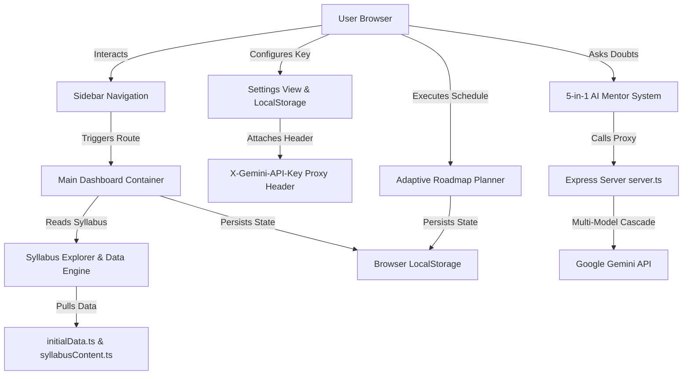

# Java DSA Journey Tracker — The Ultimate AI-Powered Coding Interview & Roadmap Command Center

Welcome to **Java DSA Journey Tracker**, a next-generation adaptive learning platform designed to accelerate Data Structures and Algorithms mastery for Java developers, computer science students, and job candidates. Java DSA Journey Tracker organizes, plans, tracks, and reinforces your study journey in a sleek, glassmorphic command center. Features include an adaptive daily roadmap planner (30, 60, 90-day tracks with auto-rescheduling for missed days), an interactive Syllabus Explorer with compilable Java blueprints, an SM-2 inspired Spaced Repetition revision engine, a LeetCode problem arena, Recharts velocity analytics, and a 5-in-1 Google Gemini AI Mentor.

---

## 🚀 How It Works
1. **Configure Your Roadmap**: Set your target deadline (30, 60, 90 days or custom) and daily study hours (Light, Balanced, Intensive) in the Onboarding Wizard.
2. **Explore the Syllabus**: Navigate through 8 curated categories from Java Basics & OOP to Advanced Dynamic Programming and Graph Algorithms.
3. **Practice & Track**: Filter LeetCode and GeeksforGeeks problems in the Practice Arena, save solution code, record time taken, and bookmark weak topics.
4. **Leverage AI Mentorship**: Connect your Google Gemini API key to activate 5 dedicated AI mentor modules for instant tutoring, side-by-side concept comparisons (`ArrayList` vs `LinkedList`), study note blueprints, and progressive problem hints (Floyd's cycle detection).
5. **Master via Spaced Repetition**: Review memory retention cards in the Revision Queue automatically prioritized by SM-2 spacing algorithms to prevent forgetting right before interviews.

---

## 🛠️ Architecture

### 1. Front-End (UI/UX)
* **Framework**: React 19 & Vite 6.
* **Styling**: Tailwind CSS v4 with custom dark/light glassmorphic palettes.
* **Animations**: Motion (Framer Motion v12) for smooth tab transitions, modal slides, and responsive navigation drawers.
* **Icons**: Lucide React.
* **Charts**: Recharts v3.9 for weekly velocity, category radars, and completion heatmaps.

### 2. Middle-End (State & Logic)
* **Client-Side Storage**: React state synced automatically with browser `LocalStorage` to persist roadmap progress, notes, problem statuses, and Gemini API key settings.
* **Adaptive Scheduler Engine**: Automatic carry-forward logic that redistributes pending topics over remaining target days when study days are skipped.
* **Spaced Repetition Algorithm**: SM-2 inspired memory decay auditing ranking topic revision priorities (High, Medium, Low).

### 3. Back-End (Data Model & AI Proxy)
* **Server Infrastructure**: Express v4.21 Node.js server (`server.ts`) proxying requests to Google Gemini AI API.
* **Multi-Model AI Cascade**: Automatic failover cascade (`gemini-2.5-flash` → `gemini-3.6-flash` → `gemini-3.5-flash` → `gemini-flash-latest`) via `@google/genai` v2.4.
* **Domain Knowledge Engine**: In-memory computer science fallback synthesizer ensuring 100% offline uptime even if rate limits occur.

---

## 📊 System Architecture Flow Chart

---

## 🤖 Agents & Tools Used
* **Vite 6 & ESBuild Compilation**: Delivers instant hot-module replacement during development and optimized single-bundle production builds.
* **Google Gemini AI SDK (@google/genai)**: Drives 5 AI modes: Conversational Tutor, Concept Comparer (Java collections & CPU cache line analysis), Smart Notes Generator, Practice Guide & Hints, and CS Architecture Advisor.
* **Local Storage & Sync Engine**: Keeps all user study data, notes, and progress persistent without requiring backend database logins, featuring encrypted JSON backup import/export.
* **Tailwind CSS v4 Variables**: Supports instant theme-switching between Dark Mode (Futuristic Glassmorphism) and Light Mode (High-Contrast Professional).

---

## 📸 Screenshots

### Dark Mode

### Light Mode

---

## 💖 Conclusion
Java DSA Journey Tracker is built by developers, for developers, to take the stress and friction out of coding interview preparation. By combining adaptive daily roadmaps, spaced repetition revision science, and an interactive 5-in-1 Google Gemini AI mentor into a single, high-contrast, fully readable command center, it empowers you to focus on what matters most: mastering data structures, writing clean Java code, and cracking software engineering placements.

Thank you so much for visiting my GitHub account and checking out this repository! If this command center helped your Java DSA journey or interview preparation, feel free to star the repository, fork it to customize your own tracker, or reach out. Happy coding! 🚀
