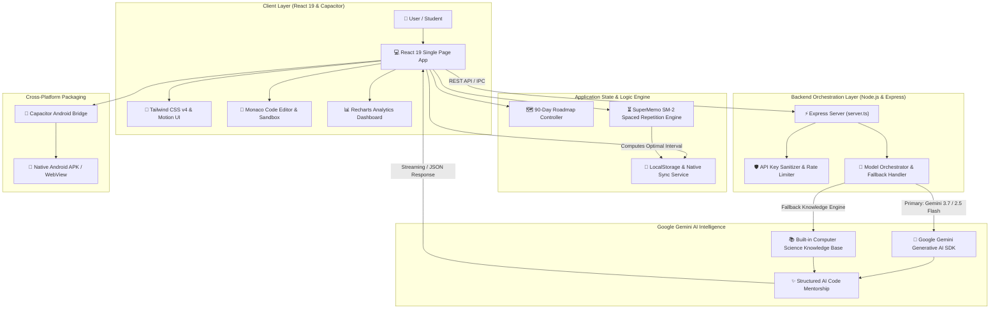

<div align="center">

# ⚡ Java DSA Journey Tracker

**An adaptive, AI-powered study planner and algorithmic interview arena featuring SuperMemo SM-2 spaced repetition, interactive code practice, dynamic progress roadmaps, and intelligent Google Gemini AI mentorship.**

[](https://www.typescriptlang.org/)
[](https://react.dev/)
[](https://tailwindcss.com/)
[](https://ai.google.dev/)
[](https://capacitorjs.com/)
[](https://vitejs.dev/)
[](LICENSE)

<br />

[Features](#-key-features) • [Application Showcase](#-application-showcase--ui-tour) • [Architecture](#-system-architecture) • [Setup Guide](#-step-by-step-implementation--setup-guide) • [How to Use](#-how-to-use--interactive-workflows) • [Project Structure](#-project-structure) • [Tech Stack](#-tech-stack) • [Contributing](#-contributing) • [License](#-license)

</div>

---

## 📖 Overview

**Java DSA Journey Tracker** is a comprehensive, production-grade learning and interview preparation platform engineered for software engineers, computer science students, and technical interview candidates. Mastering Data Structures and Algorithms requires not only solving problems once, but retaining algorithmic patterns over time and writing clean, optimal Java code under interview conditions.

Java DSA Journey Tracker combines **Google Gemini 3.7 AI Mentorship** with the scientifically proven **SuperMemo SM-2 Spaced Repetition Algorithm** to eliminate the cognitive "forgetting curve." Whether you are mastering fundamental memory layout, tackling dynamic programming memoization, or traversing complex graphs, this tracker adapts dynamically to your personal learning velocity, identifies knowledge blind spots, and delivers real-time code coaching.

---

## ✨ Key Features

- 🧠 **Google Gemini 3.7 AI Code Mentor & Interview Coach**:
  - **Dynamic Doubt Resolution**: Ask complex conceptual questions and receive instant, structured explanations with JVM memory models, diagrams, and runnable code.
  - **Progressive Hint Engine**: Stuck on a problem? Get step-by-step pedagogical hints that guide your intuition without giving away the complete solution immediately.
  - **Automated Code Review**: Analyzes your submitted Java code for edge-case vulnerabilities, JVM memory leaks, and stylistic improvements.
  - **Time & Space Complexity Breakdown**: Computes exact asymptotic Big-O bounds ($O(1)$, $O(\log N)$, $O(N)$, $O(N \log N)$, $O(N^2)$) with detailed mathematical rationale.
  - **Mock Interview Mode**: Simulates technical whiteboard rounds with adaptive follow-up questions and optimization challenges.

- ⏳ **SuperMemo SM-2 Spaced Repetition Engine**:
  - Scientifically calculates optimal review intervals ($1 \rightarrow 3 \rightarrow 7 \rightarrow 14 \rightarrow 30 \rightarrow 90$ days) based on problem difficulty and your self-reported recall performance.
  - Generates an automated **Daily Revision Queue** so you review high-yield algorithmic patterns right before you forget them.

- 📊 **Adaptive 90-Day DSA Mastery Roadmap**:
  - Comprehensive 14+ module syllabus covering **Java Fundamentals, Arrays & Two Pointers, Strings & Sliding Window, Linked Lists, Stacks & Queues, Recursion & Backtracking, Binary Trees, BSTs, Heaps & Priority Queues, Graphs (BFS/DFS/Dijkstra), Dynamic Programming, Greedy Algorithms, Tries, Bit Manipulation, and Low-Level System Design**.
  - Visual progress metrics, milestone completion bars, and prerequisite topic locking.

- 💻 **Interactive In-Browser Practice Arena & Code Sandbox**:
  - Rich Monaco-style code editing experience with Java syntax highlighting, automatic indentation, and code formatting.
  - Preloaded with standard DSA boilerplate code, sample test fixtures, and custom input/output runners.

- 📈 **Gamified Retention Analytics & Difficulty Heatmaps**:
  - Visualizes active study streaks, daily problem-solving velocity, topic mastery percentages, and weak-area radar charts using **Recharts**.
  - Real-time mastery calculation that prevents you from plateauing on easy problems.

- 📱 **Cross-Platform Web & Native Android Support**:
  - Built with **Capacitor Core & Android**, allowing seamless deployment as an installable native Android APK or an ultra-fast Progressive Web App (PWA).
  - Full touch gesture optimization, offline caching, and responsive viewport scaling.

- 🌓 **Dual-Theme Glassmorphism UI (Dark & Light)**:
  - Pixel-perfect, fluid interface powered by **Tailwind CSS v4** and **Framer Motion v12**.
  - Seamless toggle between high-contrast Dark Mode and clean Light Mode.

- 🔒 **Privacy-First Local Storage & Secure API Key Handling**:
  - Direct client-to-API communication or secure local proxying via Express.
  - Your Google Gemini API key and study data remain strictly stored on your local device—zero third-party tracking or telemetry.

---

## 🖼️ Application Showcase & UI Tour

Explore the primary modules and visual interfaces of Java DSA Journey Tracker:

### 1. Unified Dashboard — Dark Theme

> **Comprehensive Learning Command Center**: Provides an executive overview of your current 90-day progress, active problem-solving streak, topics due for spaced revision, and quick-launch action cards.  
> **Dynamic Daily Metrics**: Real-time widgets display completion percentages across beginner, intermediate, and advanced algorithmic tiers.

---

### 2. Unified Dashboard — Light Theme

> **High-Contrast Daytime Mode**: Crisp typography and balanced contrast designed for extended coding and study sessions in brightly lit environments.  
> **Instant View Switching**: Easily navigate between Syllabus Roadmap, Interactive Arena, AI Mentor, Revision Schedule, Analytics, and Settings.

---

### 3. Google Gemini API Key Configuration & Settings

> **Streamlined AI Key Setup**: Configure your personal Google Gemini API key with one-click clipboard paste and instant latency validation.  
> **Model Selection & Fallback Controls**: Easily customize AI response styles, temperature settings, and model routing preferences.

---

## 🏗️ System Architecture



---

## 🚀 Step-by-Step Implementation & Setup Guide

Follow these instructions to set up and run Java DSA Journey Tracker locally on your machine:

### Step 1: Prerequisites
Ensure you have the following installed on your system:
- **Node.js**: Version `18.0.0` or higher (`node -v`)
- **NPM**: Version `9.0.0` or higher (`npm -v`)
- **Git**: For cloning and version control
- *(Optional)* **Android Studio**: Required only if compiling the native Android APK via Capacitor.

---

### Step 2: Obtain Your Free Google Gemini API Key
1. Navigate to [Google AI Studio](https://aistudio.google.com/).
2. Sign in with your Google account.
3. Click **Get API key** → **Create API key in new project**.
4. Copy your generated API key (starts with `AIzaSy...`). *(Google provides free daily quota for Gemini Flash models!)*

---

### Step 3: Clone the Repository
Open PowerShell or Terminal:

```bash
git clone https://github.com/SriniwasAwasthi/java-dsa-tracker.git
cd java-dsa-tracker
```

---

### Step 4: Configure Environment Variables
Create a `.env` file in the root directory (or copy from `.env.example`):

```bash
cp .env.example .env
```

Open `.env` and configure your settings:
```env
PORT=3000
GEMINI_API_KEY=your_actual_gemini_api_key_here
```

---

### Step 5: Install Dependencies

```bash
npm install
```

---

### Step 6: Launch the Application

#### Option A: Quick-Launch Development Server (Full Stack with AI Proxy)
```bash
npm run dev
```
The application will launch with hot module replacement at **`http://localhost:3000`**.

#### Option B: Production Build
```bash
npm run build
npm start
```

---

### Step 7: Android APK Build (Optional)
To synchronize web assets and launch the Android project:

```bash
npx cap sync android
npx cap open android
```

---

## 💡 How to Use & Interactive Workflows

1. **Setting Up Your Profile & Goals**:
   - On first launch, the **Onboarding Wizard** prompts you to select your target timeline (30, 60, or 90 days) and skill level (Beginner, Intermediate, Advanced).
   - Enter your Gemini API key in **Settings** to unlock real-time AI code coaching.

2. **Navigating the 90-Day Roadmap**:
   - Explore topics sequentially from basic memory management up to advanced dynamic programming.
   - Click any topic to access curated theory summaries, visual diagrams, and LeetCode/GFG problem mappings.

3. **Practicing in the Interactive Arena**:
   - Write your Java solution directly in the code editor.
   - Click **Run Tests** to validate correctness against edge cases.
   - Use **Ask AI Mentor** if you encounter syntax errors or need step-by-step hints without spoiling the answer.

4. **Spaced Repetition & Daily Revisions**:
   - After completing a topic, rate your confidence level (Hard, Good, Easy).
   - The **SuperMemo SM-2** scheduler automatically places the topic into your future review queue.
   - Visit the **Revision Tab** daily to maintain active algorithmic recall.

---

## 📂 Project Structure

```text
java-dsa-tracker/
├── Images/                     # UI Screenshots and Visual Showcase Assets
│   ├── Dashboard Dark.png      # Dark theme UI capture
│   ├── Dashboard Light.png     # Light theme UI capture
│   └── Gemini Api-Key.png      # API Key setup screen
├── android/                    # Native Android Capacitor Project Files
├── app icon/                   # High-resolution application logos & icons
├── public/                     # Static web assets, manifest & favicons
├── src/
│   ├── components/             # Modular React UI Components
│   │   ├── AIMentorView.tsx    # Interactive Gemini AI Code Mentor & Chat
│   │   ├── AnalyticsView.tsx   # Visual charts, streaks & progress heatmaps
│   │   ├── CalendarView.tsx    # Spaced repetition calendar & study scheduler
│   │   ├── Dashboard.tsx       # Primary command center & high-level stats
│   │   ├── ErrorBoundary.tsx   # Graceful React runtime error handling
│   │   ├── HistoryView.tsx     # Problem submission history & review logs
│   │   ├── OnboardingWizard.tsx# Adaptive skill & timeline setup wizard
│   │   ├── ProblemsView.tsx    # Filterable problem repository & difficulty tags
│   │   ├── RecommendationsView.tsx # AI-driven weak-area recommendations
│   │   ├── RevisionView.tsx    # SuperMemo SM-2 spaced repetition queue
│   │   ├── RoadmapView.tsx     # 90-day interactive topic progression tree
│   │   ├── SettingsView.tsx    # Theme, API key, and data export settings
│   │   ├── Sidebar.tsx         # Responsive glassmorphic navigation sidebar
│   │   └── TopicsView.tsx      # Comprehensive syllabus theory & summaries
│   ├── data/                   # Static Syllabus & Preloaded Datasets
│   │   ├── initialData.ts      # Default topic states and categories
│   │   ├── programsData.ts     # Curated Java code templates & algorithms
│   │   ├── syllabusContent.ts  # Deep-dive theory, Big-O tables & examples
│   │   └── thingsToLearn.ts    # High-yield interview checklist & takeaways
│   ├── lib/                    # Core Utilities & Algorithms
│   │   ├── api.ts              # Client API helpers & Gemini proxy connectors
│   │   └── syncService.ts      # SM-2 math, state persistence & sync logic
│   ├── App.tsx                 # Root application component & theme provider
│   ├── index.css               # Tailwind CSS v4 design tokens & typography
│   ├── main.tsx                # React DOM client mount entry point
│   └── types.ts                # Strict TypeScript interfaces & data contracts
├── tests/                      # Automated unit and integration test suites
├── server.ts                   # Express server, Vite middleware & AI proxy
├── capacitor.config.ts         # Capacitor cross-platform configuration
├── package.json                # Project scripts and dependency declarations
├── tsconfig.json               # TypeScript compiler configuration
├── vite.config.ts              # Vite bundler & plugin setup
├── LICENSE                     # MIT License
└── README.md                   # Comprehensive repository documentation
```

---

## 🛠️ Tech Stack

- **Frontend & UI**:
  - **[React 19](https://react.dev/)** - Modern declarative UI library
  - **[TypeScript 5.8](https://www.typescriptlang.org/)** - Full type safety and strict data modeling
  - **[Tailwind CSS v4](https://tailwindcss.com/)** - High-performance utility-first styling
  - **[Motion](https://motion.dev/)** - Smooth micro-animations and layout transitions
  - **[Lucide React](https://lucide.dev/)** - Clean, modern iconography
  - **[Recharts](https://recharts.org/)** - Responsive data visualizations and progress heatmaps
- **Backend & AI Engine**:
  - **[Express](https://expressjs.com/)** - Node.js REST API server & static server
  - **[@google/genai](https://www.npmjs.com/package/@google/genai)** - Google Gemini SDK (Gemini 3.7 / 2.5 Flash)
  - **SuperMemo SM-2** - Mathematical spaced repetition recall engine
- **Cross-Platform & Tooling**:
  - **[Capacitor Core & Android](https://capacitorjs.com/)** - Cross-platform native runtime
  - **[Vite 6](https://vitejs.dev/)** - Next-generation frontend bundler & dev server
  - **[TSX](https://github.com/privatenumber/tsx)** - Ultra-fast TypeScript execution engine

---

## 🧪 Verification & Testing

```bash
# Run TypeScript Type Checking
npm run lint

# Run Unit & Algorithm Tests
npm test
```

---

## 🤝 Contributing

Contributions are welcome! If you'd like to improve features, add new DSA problem sets, or refine AI prompt templates:

1. **Fork** the repository: `https://github.com/SriniwasAwasthi/java-dsa-tracker`
2. **Create your feature branch**: `git checkout -b feature/AmazingFeature`
3. **Commit your changes**: `git commit -m "Add AmazingFeature"`
4. **Push to the branch**: `git push origin feature/AmazingFeature`
5. **Open a Pull Request**.

See [`CONTRIBUTING.md`](CONTRIBUTING.md) for full contribution guidelines.

---

## 📄 License

This project is open source and available under the **[MIT License](LICENSE)**.

---

## 💖 Thank You for Exploring Java DSA Journey Tracker!

> *"Continuous algorithmic practice and clean code craftsmanship build extraordinary software engineers."* 🚀

Thank you for visiting and exploring the **Java DSA Journey Tracker** repository! If you find this project valuable for your learning and interview preparation, please consider giving it a ⭐ **Star** on GitHub.

Feel free to connect or reach out for software engineering roles, technical discussions, or collaborations:

* 🌐 **LinkedIn:** [sriniwas-awasthi](https://www.linkedin.com/in/sriniwas-awasthi/)
* 💻 **GitHub:** [@SriniwasAwasthi](https://github.com/SriniwasAwasthi)
* 📧 **Email:** [sriawasthi164@gmail.com](mailto:sriawasthi164@gmail.com)

---

<div align="center">
  <sub>Crafted with passion by <b>Sriniwas Awasthi</b> • Powered by Google Gemini AI</sub>
</div>
