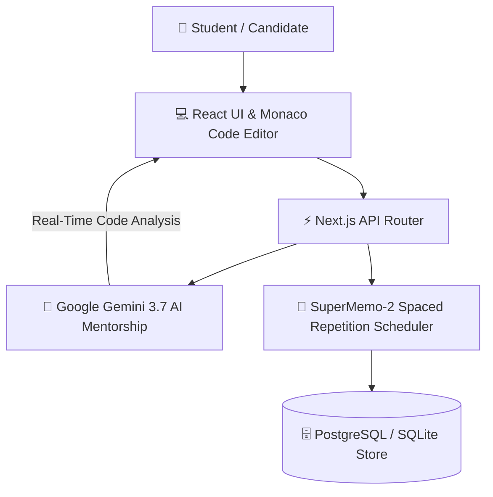

# 🚀 Java DSA Journey Tracker

> **An AI-Powered Java & Data Structures & Algorithms Adaptive Learning Platform, Study Roadmap Planner, and Spaced Repetition System.**


---

## 📋 Table of Contents

- [📌 What is Java DSA Tracker?](#-what-is-java-dsa-tracker)
- [💡 Why It Is Used](#-why-it-is-used)
- [✨ What All Stuff is Present Inside It](#-what-all-stuff-is-present-inside-it)
- [🔑 How to Set Up & Use Gemini API Key](#-how-to-set-up--use-gemini-api-key)
- [📖 How a Person Can Use It](#-how-a-person-can-use-it)
- [⚡ Quick Start & Installation Guide](#-quick-start--installation-guide)
- [🛠️ Tech Stack & Folder Structure](#️-tech-stack--folder-structure)
- [📜 License](#-license)
- [📬 Contact & Author](#-contact--author)

---

## 📌 What is Java DSA Tracker?

**Java DSA Journey Tracker** is a full-stack, AI-powered learning workspace built to help computer science students, job seekers, and Java developers systematically prepare for technical coding interviews and campus placements.

It transforms raw DSA syllabi into an **adaptive daily roadmap**, reinforces long-term memory via **spaced repetition revision queues**, and provides instant technical tutoring using **Google Gemini AI**.

---

## 💡 Why It Is Used

Preparing for technical coding interviews on platforms like LeetCode or GeeksforGeeks is notoriously challenging due to four major pain points:

1. **Unstructured Preparation**: Jumping into complex Graph or Dynamic Programming problems without a clear prerequisite path.
2. **Memory Retention Decay**: Studying a topic once and completely forgetting key edge cases, Big-O metrics, or JVM memory concepts 3 weeks later.
3. **Rigid Schedule Failure**: Falling behind by a few days and abandoning the entire study plan because static schedules cannot auto-adjust.
4. **Vague AI Assistance**: Generic AI chats that return non-compilable code or generic explanations without computer science depth.

`java-dsa-tracker` solves all four problems in a single, privacy-focused dashboard equipped with dark and light themes.

### 🖼️ Application Interfaces

#### Dark Mode Dashboard


#### Light Mode Dashboard


---

## ✨ What All Stuff is Present Inside It

### 1. 🗓️ Adaptive Daily Roadmap Planner
- Custom 30-day crash courses, 60-day balanced schedules, or 90-day mastery roadmaps.
- **Auto-Carry Forward**: If you miss a day, click **Re-adjust Schedule** to redistribute pending topics smoothly over remaining days without breaking your deadline.

### 2. 📚 Comprehensive Syllabus Explorer
- 8 core modules: Java Basics, Object-Oriented Programming (OOP), Java Collections Framework, Basic DSA, Linear DSA, Non-Linear DSA, Algorithms, and Advanced DSA.
- Interactive dependency trees ensuring prerequisites (e.g. Arrays $\rightarrow$ Two Pointers $\rightarrow$ Sliding Window) are completed in order.
- Compilable Java code blueprints, interview tips, formulas, and mastery state trackers (*Reading*, *Understood*, *Practiced*, *Mastered*).

### 3. 🎯 Practice Arena
- Curated coding problem sets filterable by topic, difficulty (Easy, Medium, Hard), and status (*Unsolved*, *Solved*, *Revision*).
- Direct links to LeetCode and GeeksforGeeks with solution logging, time taken counters, and personal note taking.

### 4. 🧠 SM-2 Spaced Repetition Revision Queue
- Automated retention audit flagging weak topics based on last studied date, review count, and difficulty.
- Priority queues (*High*, *Medium*, *Low*) preventing knowledge decay right before interviews.

### 5. 🤖 5-in-1 Google Gemini AI Mentor System
- **Conversational Mentor**: Conversational Java, DSA, and JVM memory internals (Stack vs Heap, Metaspace, GC) tutor.
- **Concept Comparer**: Side-by-side technical comparison engine (`ArrayList` vs `LinkedList`, `HashMap` vs `TreeMap`) evaluating operational Big-O bounds, JVM pointer overhead, and CPU cache line locality.
- **Smart Notes Generator**: Instant study note blueprints with core definitions, real-world analogies, compilable Java templates, and exam checklists.
- **Practice Guide & Hints**: Step-by-step problem guide offering pattern recognition, progressive clues (Hint 1, 2, 3), Floyd's cycle detection strategies, and compilable code skeletons.
- **CS Architecture Advisor**: Strategic planner for node architectures, graph state traversals, and multi-week study roadmaps.

### 6. 📊 Analytics & Progress Dashboard
- Recharts-powered velocity graphs, weekly study hours, completion percentages, streak counters, and calendar completion heatmaps.

---

## 🔑 How to Set Up & Use Gemini API Key

> [!IMPORTANT]
> **AI Mentor Requirement**: To use any of the 5 AI Mentor modules (Conversational Tutor, Concept Comparer, Smart Notes, Practice Hints, CS Architecture Advisor), the user **MUST** add a Google Gemini API Key in Settings. Until a valid key is connected, the AI Mentor features will be unavailable.

### Step-by-Step API Key Setup:

1. **Obtain a Free Key**: Go to [Google AI Studio](https://aistudio.google.com/app/apikey) and generate a new Gemini API key.
2. **Open Settings**: Launch `java-dsa-tracker` and click **Settings** from the left sidebar menu.
3. **Navigate to Gemini API Key Section**: Locate the **Gemini API Key** configuration card.
4. **Enter & Save**: Paste your API key (`AQ...` or `AIza...`) into the input field and click **Save Key**.
5. **Connection Verification**: The app will test the API key instantly. Once verified, a green **Status Connected** badge will appear.
6. **Start Learning**: Your key is stored strictly in your browser's private `localStorage`. You can now use all 5 AI Mentor modules seamlessly!

### 🖼️ Settings API Key Interface


---

## 📖 How a Person Can Use It

### Step 1: Complete Initial Onboarding
When you launch the app for the first time, set your learning goal (e.g. 60 Days, 2 Hours/Day, Placement Candidate level).

### Step 2: Follow Today's Roadmap
Open **Study Roadmap** to check today's assigned topics and practice problems. As you complete topics, mark them as completed.

### Step 3: Explore Syllabus & Practice
Open **Syllabus Explorer** to read compilable code examples and formulas. Practice related problems in the **Practice Arena** and log your solutions.

### Step 4: Ask Doubts to the AI Mentor
Connect your Gemini API Key in Settings, open **AI Mentor**, and select any of the 5 modules to resolve doubts, generate study notes, or get progressive problem hints.

### Step 5: Review Revision Queue Daily
Open **Revision Queue** daily to review topics flagged for revision. Mark topics as *Mastered* to update retention intervals.

---

## ⚡ Quick Start & Installation Guide

### Prerequisites
- **Node.js**: `v18.0.0` or higher
- **NPM**: `v9.0.0` or higher
- **Git**: Installed on your machine

### 1. Clone & Install
```bash
git clone https://github.com/SriniwasAwasthi/Java-DSA-tracker.git
cd Java-DSA-tracker
npm install
```

### 2. Run Locally
```bash
npm run dev
```
Open your browser at 👉 `http://localhost:3000/`

---

## 🛠️ Tech Stack & Folder Structure

- **Frontend**: React 19, TypeScript 5.8, Tailwind CSS v4, Motion (Framer Motion v12), Lucide React, Recharts v3.9.
- **Backend & Server**: Node.js, Express v4.21, `tsx`, `esbuild`, `@google/genai` v2.4 SDK.
- **Cross-Platform**: Capacitor v8.4 Core & Android.

```text
Java-DSA-tracker/
├── images/                    # Screenshot images (Dashboard, Gemini API Key)
│   ├── Dashboard Dark.png
│   ├── Dashboard Light.png
│   └── Gemini Api-Key.png
├── src/
│   ├── components/            # AIMentorView, Dashboard, RoadmapView, SettingsView, etc.
│   ├── data/                  # Syllabus topics, compilable code templates, metadata
│   └── lib/                   # API headers helper & sync service
├── server.ts                  # Express backend & Gemini AI proxy server
├── README.md                  # Application documentation
└── package.json               # Dependencies and scripts
```

---

## 📜 License

Distributed under the **MIT License**.

---

## 📬 Contact & Author

- **Author**: Sriniwas Awasthi
- **GitHub**: [https://github.com/SriniwasAwasthi](https://github.com/SriniwasAwasthi)
- **LinkedIn**: [https://www.linkedin.com/in/sriniwas-awasthi210728/](https://www.linkedin.com/in/sriniwas-awasthi210728/)
- **Project Link**: [https://github.com/SriniwasAwasthi/Java-DSA-tracker](https://github.com/SriniwasAwasthi/Java-DSA-tracker)

### ⭐ Star the Repository!
If `Java-DSA-tracker` helped your Java DSA journey or coding interview preparation, please give this repository a **Star** ⭐️!

---

## 💖 Heartfelt Thanks to Visitors & Viewers

Thank you so much from the bottom of my heart for spending your valuable time exploring my GitHub portfolio 💼 and analyzing the **Java DSA Journey Tracker** project 🚀! It is a true privilege to share my work with you 🌟, and I deeply appreciate the effort and attention you took to review the features ⚙️, UI design 🎨, and code implementation 💻.

Whether you visited to review my technical skillset 🛠️, explore the codebase 🔍, or use the tool for your own DSA preparation 📚, I am sincerely grateful for your support 💖. Please feel free to star this repository ⭐️ or reach out via LinkedIn 🌐. Thank you for your precious time and have a wonderful, successful day ahead! ☕️🌈✨

---

---

## 💖 Thank You for Exploring Java DSA Tracker!

> *"Mastering algorithms one concept at a time—thank you for your support!"* ⚡

Thank you for taking the time to review the Java DSA Tracker! Building an adaptive revision engine that pairs spaced repetition with Google Gemini AI mentorship was engineered to make rigorous technical interview preparation consistent and structured. Your review and attention mean the world to me.

- 🌟 **Grinding DSA or prepping for interviews?** Star this repository to support open-source coding interview tools!
- 📬 **Let's Connect:** I'm always eager to discuss algorithmic problem solving, Java optimization, and interview strategies. Find me on [GitHub](https://github.com/SriniwasAwasthi).

*Wishing you clean syntax, $O(1)$ complexity, and tremendous success in your technical interviews!* ✨

---

<div align="center">
  <sub>Engineered for algorithmic mastery and interview success by <a href="https://github.com/SriniwasAwasthi">Sriniwas Awasthi</a>.</sub>
</div>

## 🏛️ System Architecture


