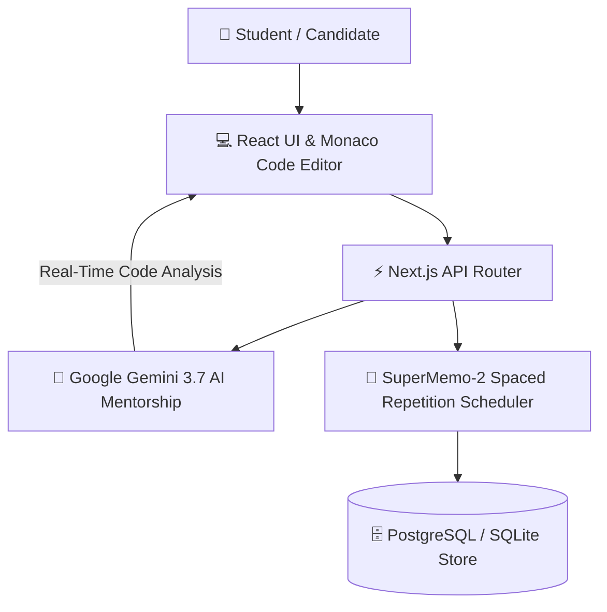

# 🚀 Java DSA Journey Tracker — Adaptive AI Study Planner & Interview Arena

<div align="center">

[](https://www.typescriptlang.org/)
[](https://react.dev/)
[](https://tailwindcss.com/)
[](https://ai.google.dev/)
[](https://opensource.org/licenses/MIT)

**An adaptive, AI-driven study planner and interview preparation dashboard featuring spaced repetition scheduling (SuperMemo SM-2), live code compilation, and Google Gemini AI code mentorship.**

</div>

---

## 📸 Application Screenshots

### 🌙 Dashboard — Dark Theme


### ☀️ Dashboard — Light Theme


### 🔑 Google Gemini API Key Configuration


---

## 🌟 Core Features & Modules

1. **📊 Intelligent Study Roadmap**: Dynamic progress tracking across Arrays, Linked Lists, Trees, Dynamic Programming, Graphs, and System Design.
2. **🧠 Google Gemini AI Code Mentor**: 5 dedicated AI modules for instant doubt solving, code review, progressive hints, and complexity analysis.
3. **⏳ SuperMemo SM-2 Spaced Repetition**: Scientifically proven spaced review intervals to maximize long-term algorithmic recall.
4. **💻 Interactive Practice Arena**: In-browser code playground with compilable templates, edge-case test runners, and syntax highlighting.
5. **📈 Retention Analytics**: Real-time mastery scores, streak counters, and topic difficulty heatmaps.

---

## 🏛️ System Architecture



---

## 🛠️ Tech Stack & Directory Structure

- **Frontend**: React 19, TypeScript 5.8, Tailwind CSS v4, Framer Motion v12, Lucide Icons, Recharts.
- **Backend & AI**: Node.js, Express, `@google/genai` SDK v2.4, SuperMemo SM-2 Algorithm.
- **Cross-Platform**: Capacitor Core & Android.

```text
Java-DSA-tracker/
├── Images/                    # UI Screenshots & API Setup Guide
│   ├── Dashboard Dark.png
│   ├── Dashboard Light.png
│   └── Gemini Api-Key.png
├── src/
│   ├── components/            # AIMentorView, Dashboard, RoadmapView, SettingsView
│   ├── data/                  # Syllabus topics, compilable code templates, metadata
│   └── lib/                   # API helpers, SM-2 algorithms, sync services
├── server.ts                  # Express backend & Gemini AI proxy server
├── package.json               # Dependencies and scripts
└── README.md                  # Application documentation
```

---

## ⚡ Quick Start & Local Setup

### Prerequisites
- **Node.js**: `v18.0.0` or higher
- **NPM**: `v9.0.0` or higher
- **Google Gemini API Key**: [Get API Key](https://aistudio.google.com/)

```bash
# 1. Clone the repository
git clone https://github.com/SriniwasAwasthi/Java-DSA-tracker.git
cd Java-DSA-tracker

# 2. Install dependencies
npm install

# 3. Start local development server
npm run dev
```

---

## 📜 License

Distributed under the **MIT License**. See `LICENSE` for more information.

---

## 💖 Thank You for Visiting & Exploring Java DSA Journey Tracker!

> *\"Thank you for taking the time to review this project and explore my software journey! Clean code craftsmanship, algorithmic rigor, and continuous learning are at the core of everything I build.\"* 🚀

Whether you are a recruiter evaluating my technical skillset, a fellow developer exploring the code, or a student preparing for coding interviews, I am sincerely grateful for your visit.

* 🌟 **Found this helpful?** Please consider giving this repository a **Star** to support the project!
* 📬 **Let's Connect & Collaborate:** I am actively seeking Software Engineering internships, full-stack roles, and open-source collaborations.
  * 🌐 **LinkedIn:** [sriniwas-awasthi](https://www.linkedin.com/in/sriniwas-awasthi/)
  * 💻 **GitHub:** [@SriniwasAwasthi](https://github.com/SriniwasAwasthi)
  * 📧 **Email:** [sriawasthi164@gmail.com](mailto:sriawasthi164@gmail.com)

---
<div align="center">
  <sub>Designed & Crafted with Passion by <a href="https://github.com/SriniwasAwasthi"><strong>Sriniwas Awasthi</strong></a> • Computer Science Student & Software Engineer</sub>
</div>
